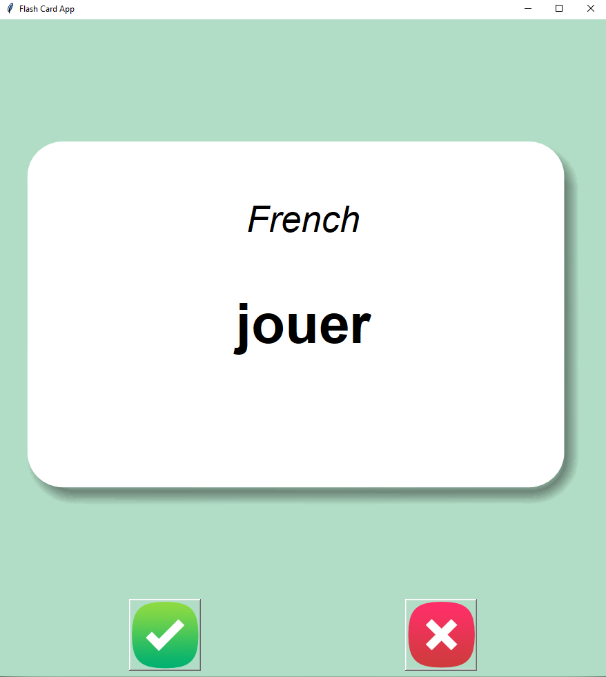
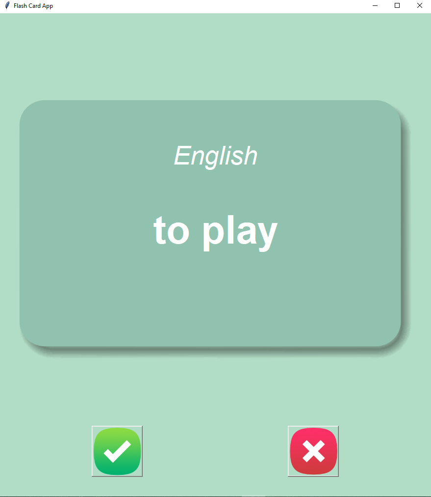

# Flash Card App 🖊️

## Description

This is a Flash Card App built with Python and Tkinter, designed to help users learn and memorize vocabulary. The application displays words in French along with their English translations, flipping the card after a few seconds to reveal the translation. Users can mark whether they know a word, and the app keeps track of words yet to be learned.

## Features

- **Flash Card Interface**: Displays a flashcard with a French word and flips to reveal the English translation.
- **Track Progress**: Keeps track of words that are known and stores remaining words to learn in a separate file.
- **Customizable Delay**: Automatically flips the card after a 3-second delay.
- **Interactive Buttons**: Users can mark words as "known" or skip them for further review.
- **Data Persistence**: Stores progress in a CSV file (`words_to_learn.csv`), which is loaded automatically on the next session.

<p align="center">
  
  
</p>

## Requirements

- Python 3.x
- `pandas` library (install via `pip install pandas`)
- `tkinter` (pre-installed with Python)

## How to Use

<details>
<summary>Click here for detailed instructions</summary>

1. **Start the Application**:
   - Run the `main.py` script using Python. This will open the Flash Card App GUI.

2. **View Cards**:
   - The app displays a French word on the front of the card.
   - Wait for 3 seconds to see the English translation or flip the card manually.

3. **Mark Known Words**:
   - Click the “Right” button if you know the word. This will remove it from the list of words to learn.
   - Click the “Wrong” button to skip the word and keep it in the list for future review.

4. **Save Progress**:
   - Known words are saved in `words_to_learn.csv`. If the file doesn’t exist, the app creates it automatically.

5. **Resume Learning**:
   - On restarting the app, it automatically loads the `words_to_learn.csv` file to continue progress.

</details>

## Code Structure

The project consists of several files. Here is a breakdown of each file and its purpose:

<details>
<summary>Click here for file breakdown</summary>

### `main.py`
- **Purpose**: Contains the core logic for the Flash Card App, including GUI setup, word selection, and user interactions.
- **Key Functions**:
  - `__init__`: Initializes the app, sets up the GUI, and loads the vocabulary data.
  - `get_words`: Displays a random French word on the card.
  - `flip_card`: Flips the card to reveal the English translation.
  - `is_known`: Removes a known word from the learning list and updates the CSV file.

### `constants.py`
- **Purpose**: Stores constant values like file paths, colors, and font used in the app.

### `images/`
- **Purpose**: Contains image assets for the app:
  - `card_front.png`: Front side of the flash card.
  - `card_back.png`: Back side of the flash card.
  - `right.png`: Image for the “Right” button.
  - `wrong.png`: Image for the “Wrong” button.

### `data/french_words.csv`
- **Purpose**: The original dataset containing French and English words.

### `data/words_to_learn.csv`
- **Purpose**: Tracks words yet to be learned. This file is created or updated during the app’s runtime.

</details>

## How to Run

1. Clone or download the project files.
2. Install the required libraries:
   - `pip install pandas`
3. Open a terminal or command prompt and navigate to the project directory.
4. Run the application with the following command:
    ```
   python main.py
   ```

## Future Improvements

<details>
<summary>Click here for possible future improvements</summary>

- **Improvement 1**: Add support for multiple languages.
- **Improvement 2**: Allow users to adjust the flip delay dynamically from the GUI.
- **Improvement 3**: Include a progress tracker showing the percentage of known words.
- **Improvement 4**: Provide an option to reset progress and start fresh.

</details>

## Credits

This project was created as part of a learning exercise in Python, focusing on GUI development with Tkinter and data handling with pandas.

## Change Log

<details>
<summary>Click here to view change log</summary>

### Version 1.0.0
- **Initial Release**:
  - Basic flash card functionality for learning French to English translations.
  - Progress tracking with `words_to_learn.csv`.
  - Interactive buttons for marking words as known or skipping them.

### Bug Fixes
- Fixed issues with card flipping and random word selection.

### Known Issues
- No known issues at this time.

</details>

